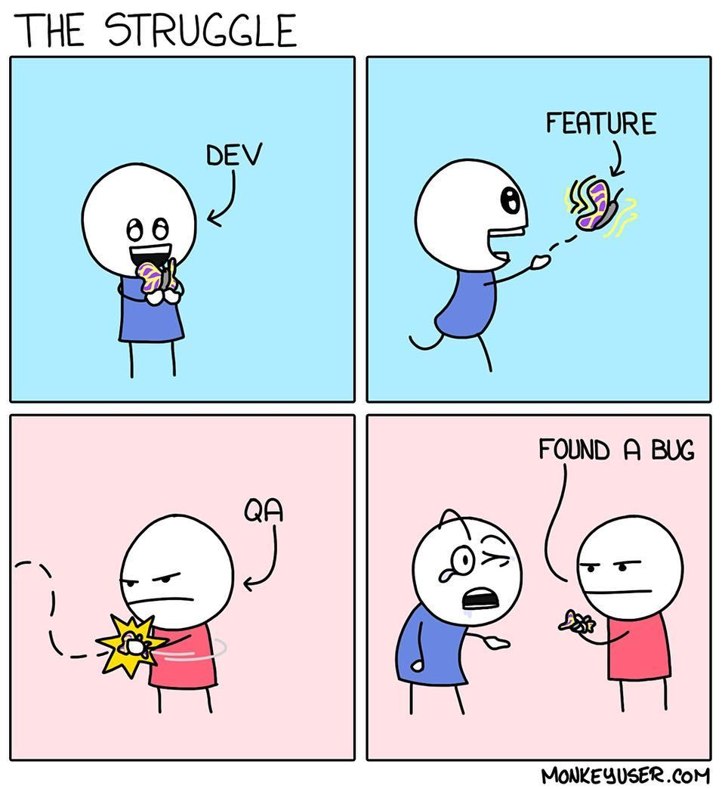

[![VK][vk-shield]][vk-url]
<br>
[![Успеваемость][gdoc-shield]][g-doc]

<!-- PROJECT LOGO -->
<br />
<div align="center">
  <a href="https://github.com/othneildrew/Best-README-Template">
    
  </a>

  <h1 align="center">Управление производственным процессом разработки ПО</h1>

</div>

<!-- TABLE OF CONTENTS -->
<a name="course-introduction"></a>
<details>
  <summary>Содержание</summary>
  <ol>
    <li>
      <a href="#introduction">Введение</a>
    </li>
     <li>
      <a href="#dev-requrements">Требования к разработке</a>
    </li>  
    <li><a href="#git">Git</a></li>
      <ul>
        <li><a href="#git-init-locally">Создание локального git репозитория</a></li>
        <li><a href="#git-init-remote">Работа с удаленным git репозиторием</a></li>
        <li><a href="#git-introduction">Краткий экскурс по основным командам</a></li>
        <li><a href="#git-lab">Задача на лабу</a></li>
      </ul>
    <li><a href="#bug-and-task-managent">Bug and Task менеджмент</a></li>
    <li><a href="#project-hierarchy-and-building">Project hierarchy and building</a></li>
    <li><a href="#continuous-integration">Continuous integration</a></li>
    <li><a href="#unit-testing">Юнит тесты</a></li>
    <li><a href="#automatically-generated-documentation">Automatically generated documentation</a></li>
    <li><a href="#static-code-analyzation">Static code analyzation</a></li>
  </ol>
</details>


<!-- Введение -->
<a name="introduction"></a>
## Введение

В рамках данного курса вам предлагается познакомиться с промышленной разработкой и попробовать себя в роли DevOps, Developer, QA.

 Для введения в предметную область - вам необходимо выполнить лабораторные работы. Задача на лабораторные работы - реализовать мини версию проекта, используя практики промышленной разработки.

* Цель лабораторных работ — изучение инструментария и практик, применяющихся при разработке программного обеспечения.

В результате данного курса вам необходимо реализовать законченный проект, включающий в себя:

1. Приложение, разработанное в соответствии с заданием.
2. Систему сборки.
3. Unit-тесты.
4. Настроенные автоматические сборки (CI).
5. Автоматичекую документацию.
6. Отслеживание задач с помощью системы багтрекинга.

Работа над проектом разбивается на короткие итерации. Процесс разработки должен быть зафиксирован в системе контроля версий (git). Проект должен быть опубликован на Github (можно Gitlab, Bitbucket).

* Цель курсовой работы — разработка законченного программного продукта. При этом важно отличать программу от программного продукта.

`Программный продукт` — программа, которую любой человек может запускать, тестировать, исправлять и развивать. Такая программа должна быть написана в обобщенном стиле. В частности, диапазон и вид входных данных должны быть настолько обобщенными, насколько это допускается базовым алгоритмом. Затем программа должна быть тщательно протестирована. Наконец, развитие программы в программный продукт требует создания подробной документации.

**Пример недопустимого кода в программном продукте:**
 ```c++
 FILE *dict = fopen("/home/v.pupkin/myproject/dict.txt", "r");
   ```

<p align="right">(<a href="#course-introduction">к содержанию</a>)</p>

<!-- Требования -->
<a name="dev-requrements"></a>
## Требования к разработке <a name="course-requirements"></a>

_Данные требования - обязательны в промышленной разработке. Код должен быть максимально общим, простым, понятным и достаточно эффективным._

1. Необходимо следовать code style соглашениям. В приоритете использование Google code style для вашего языка программирования, при большом желании можно выбрать другие соглашения, некоторые из них:
  <br>`Google C++ Style Guide` https://google.github.io/styleguide/cppguide.html
  <br>`PEP 7` https://www.python.org/dev/peps/pep-0007/
  <br>`Qt Coding Style` https://wiki.qt.io/Qt_Coding_Style
  
2. Необходимо настроить clang-format для автоматического форматирования.
  <br>_Позже будет проверяться с помощью статических анализаторов кода._
3. Соблюдать консистентность кода в рамках проекта.
4. Чтение документации к используемым инструментам и использование по современным стандартам.
5. Терминал - наше все. Стараться использовать его по максимуму.
<p align="right">(<a href="#course-introduction">к содержанию</a>)</p>

<!-- Git -->
<a name="git"></a>
## Git

**Рекомендуется к прочтению: <a href="https://git-scm.com/book/en/v2">Pro Git</a>**
<a name="git-init-locally"></a>
### Создание локального git репозитория
```sh
$ cd <path-to-project>
$ mkdir <project-name>
$ cd <project-name>
$ git init <git-repository-name> 
$ echo "# <git-repository-name>" >> README.md
$ git init
$ git add README.md
$ git commit -m "first commit"
$ git branch -M master
```

<a name="git-init-remote"></a>
### Работа с удаленным git репозиторием
- [x] Создать и прокинуть ssh public ключик в удаленный репозиторий. (В github: Settings -> SSH and GPG keys -> New SSH key). Необходимо для синхронизации с удаленным репозиторием по протоколу SSH.

<a name="first-push-to-origin"></a>
```sh
$ git remote add origin git@github.com:user-name/project-name.git
$ git push -u origin master
```

<a name="git-introduction"></a>
### Краткий экскурс по основным командам
<br>`git status` - Посмотреть текущую информацию об изменении в вашем репозитории. (staged/unstaged, tracked/untracked)
<br>`git log` - Посмотреть историю коммитов, начиная с HEAD.
<br>`git add <path-to-file>` - Добавить файл в staging. Удобно пользоваться **Git gui** утилитой для просмотра текущих изменений и добавлении их в staging стадию(готовность к созданию коммита).
<br>`git commit` - Создать коммит. Удобно использовать git commit -m "commit content"
<br>`git reset <hash-commit | branch>` - Откатить текущую ветку на указанный коммит. Опции --hard и --soft.
<br>`git branch <branch-name>` - Создать ветку под именем branch-name, указывающую на HEAD. 
<br>`git checkout <branch-name>` - Переместиться на ветку branch-name.
<br>_P.S. Удобно использовать `git checkout -b <branch-name>` для создания новой ветки и перехода на нее одной командой._
<br>`git fetch` - обновление всех origin веток в локальном репозитории, при этом не выполняя merge локальных веток в обновленные origin
<br>`git merge` - нахождение diff между двумя ветками, после чего создание мердж коммита в текущей ветки, который содержит diff между ветками.
<br> **Важные опции merge** `--no-ff` - для наглядности операций в git history, создает merge commit в любом случае
<br>`git pull` - объединение двух операций: git fetch и git merge. Сначала выполняется git fetch, после чего выполняется merge на состояние origin ветки.
<br>`git cherry-pick` <hash_of_commit | branch_name | tag> - выполняет копию коммита, который указан в параметре и вставляет после текущего положения HEAD. 
<br>`git rebase` - последовательность из cherry-pick.
<br> **Важные опции rebase** `-i` - интерактивный ребейз. Позволяет посмотреть какие коммиты будут скопированы, а также позволяет выбросить некоторые из коммитов при копировании и другие возможности (см. в git help и файле редактирования коммита во время интерактивного ребейза).
<br> `--onto`. Для указания диапазона, с какого коммита начинать ребейз, на каком заканчивать, куда копировать.
<br> _Например: представим, что мы находимся на ветке FeatureName1 и хотим выполнить ребейз части этих коммитов в ветку FeatureMain._
<br> _В этом помогает команда:_
```sh
 git rebase --onto FeatureMain <hash-start-commit> <hash-end-commit>
 ```
Данная команда выполнит последовательность cherry-pick начиная со следующего после hash-start-commit, заканчивая hash-end-commit.
<br> 

### Требования к оформлению коммитов
- [x] Каждый коммит должен содержать ровно одно изменение. Например, если в описании можно поставить союз "и" (_"действие" и "действие"_) - это не правильно. Должно быть разбито на 2 коммита. Перенос кода из одного места в файле в другое, добавление кода, удаление кода и изменение кода - разные действия. 
<br> **Если коммиты разбиты правильно - ревьювер будет вам благодарен!**
- [x] Оформлять коммиты на английском языке (общепринятое правило)
- [x] Содержать ID задачи (пока что пропускаем этот пункт, будет требоваться после лабы про bug/task менеджмент)
- [x] Добавлять заголовок. Очень краткое описание всех изменений, которое первым видит разработчик в инструменте контроля версий
- [x] Делать отступ между заголовком и описанием. Пустая строка после заголовка, после пустой строки может быть, а может и не быть описание. В коммитах, где описание изменений понятны по одному лишь заголовку - описание не требуется
- [x] Писать заголовок с заглавной буквы 
- [x] Не ставить точку в конце заголовка
- [x] Использовать в заголовке глагол в форме инфинитива
- [x] Ограничивать длину строки в теле описания 72 символами
- [x] Описание должно отвечать на вопросы "Что было сделано" и "Почему было сделано"

**Пример хорошего коммита:**
```
[TaskID-123] Refactor validator implementation

Improved code design for better readability
```

<a name="git-lab"></a>
### Задача на лабораторную работу
1. Инициализация репозитория:
   1. Зарегистрироваться на github
   2. Сгенерировать ssh ключ и добавить его в удаленный репозиторий
   3. <a href="https://git-scm.com/download">Скачать и установить git</a>
   4. Настройка среды (локально задать имя пользователя, электронную почту и т.д. с помощью утилиты git config --global, эти данные будут отображаться в каждом коммите конкретного пользователя)
   5. Локально инициализировать репозиторий с помощью `git init`
   6. Создать initial commit, содержащий файл README.md с кратким описанием лабораторной (3-5 строк) и файл .gitignore для игнорирования не функциональных изменений
   7. Выполнить инициализирующий git push в удаленный репозиторий <a href="#first-push-to-origin">First git push</a> 
2. Задать правила для master ветки. (Project settings -> Branches -> Add rule)
3. Для упрощения ввода команды `git log`, можно создать алиас (синоним). Для этого нужно выполнить в терминале:
  ```sh
  git config --global alias.hist "log --oneline --decorate --graph --all"
  ```
  **После чего станет доступна команда git hist**

4. Разбиться на пары, продемонстрировать работу каждой <a href="#git-introduction">команды</a>. Необходимо понимать каждую из этих команд, это необходимый минимум при работе с git 
5. Творческое задание. Каждой паре необходимо создать 2 ветки и создать "осмысленный" конфликт. Осмысленный - означает вы должны понимать, что при слиянии двух веток - у вас появится конфликт. Допустим, что при выполнении git merge --no-ff ConflictedBranch возникает конфликт
   1. Выполнить `git merge --no-ff ConflictedBranch` 
   2. Добавить все изменения в git staging "как есть", без исправления конфликта.
   3. Выполнить `git merge --continue`
   4. Создать ветку ConflictFixing, починить конфликт и создать Pull request с таргетом на конфликтную ветку
   5. Выполнить merge в github web
   6. Выполнить локально git pull для обновления локального репозитория (теперь резолв конфликта вмержен в ветку)
   7. Создать Pull request данной ветки с таргетом в мастер
   8. Выполнить merge в мастер, выполняя все требования к мержу в protected ветку
   9. Выполнить локально git pull для соответствия удаленному репозиторию
6.  Придумать применение команды git rebase --onto BranchName1 Hash1 Hash2
 
<p align="right">(<a href="#course-introduction">к содержанию</a>)</p>

<a name="bug-and-task-managent"></a>
<!-- -->
## Bug and Task менеджмент

**Рекомендуется к прочтению: <a href="https://community.atlassian.com/t5/Jira-Software-articles/How-to-Use-Jira-for-Project-Management-in-2023/ba-p/2332078">Jira for project management</a>**
<a name="JIRA-introduction"></a>
### Зачем нужна Jira
- [x] Прозрачное управление задачами
- [x] Мониторинг прогресса
- [x] Планирование задач
- [x] Гибкость и настраиваемость
- [x] Управление Scrum, Kanban и др.
- [x] Уточнение истории git с помощью референсов на тикеты

### Введение
`Берем за основу Scrum template для Jira проекта`

По теории Scrum, 1 спринт равен 2 неделям, но т.к. в рамках лабораторной работы сроки достаточно сжатые, мы будем считать спринт равным 1/2 недели.

Глобальные настройки Jira находятся в правом верхнем углу, рядом с иконкой профиля (раздел issues особенно полезен для нас, т.к. позволяет кастомизировать содержание полей тасок)

Настройки проекта находятся во вкладке `Projects` в самом низу 

Dashboard служит для отображения различной статистики по выполнению задач, по успешности спринта, средство уведомления и т.д.

`Screens` и `Fields` настройки находятся в глобальных настройках issues

1. Эпик (epic) — большая задача, на решение которой команде нужно несколько спринтов.
2. История (story) — часть большой задачи (эпика), которую команда может решить за 1 спринт
3. Задача (task) — техническая задача, которую делает один из членов команды.
4. Под-задача (sub-task) — часть истории или задачи, которая описывает минимальный объём работы члена команды.
5. Баг (bug) — задача, которая описывает ошибку в системе.


<a name="git-lab"></a>
### Задача на лабораторную работу

1. Зарегистрироваться на Jira
2. Создать Scrum проект
3. Поизучать глобальные настройки
4. Поизучать настройки проекта
5. Создать кастомный Dashboard
6. С помощью `Screens и Fields` добавить требование **к каждой таске указывать описание и трудоемкость**
7. С помощью `Screens и Fields` добавить требование **указывать conclusion при переносе задачи в Done**
8. С помощью `Task workflow` создать статусы To do, In progress, In code review, Done и назначить логичные связи
9. Создать Epic таску
10. Создать Story таску и прилинковать к Epic
11. Создать конечные таски (task), прилинковать к Epic и указать Story
12. Синхронизировать Github с Jira
13. Привязать таски к спринту и создать спринт на 1/2 недели
14. В настройках проекта -> Custom filters создать фильтр на отслеживание Story
15. Выполнить несколько заведенных **конечных** задач

<p align="right">(<a href="#course-introduction">к содержанию</a>)</p>

<!-- -->
## Project hierarchy and building
### Введение
Для разных проектов, разных языков программирования, разных систем сборки требуется своя собственная архитектура и структура проекта.
Есть базовые правила для создания файловой структуры, шаблоны, но в итоге все равно требуется подгонять файловую иерархию под себя.
Важно отделять различные сущности друг от друга и придерживаться структуры, которая будет **понятна** не знакомому с вашим проектом разработчику.
<br>
Примеры структур проектов лучше всего поискать на github.
<br>
<a href="https://akutz.wordpress.com/2008/05/30/a-cross-language-project-structure/">Наиболее общая структура проекта, которую мне удалось найти</a>

<a name="build-lab"></a>
### Задача на лабораторную работу
`Для ускорения работы над проектом, предлагается начиная с этой лабы работать над подготовкой проекта для непосредственной разработки`
1. Разбиться на команды (желательно по 3-4 человека на команду)
2. Придумать тему проекта или хотя бы набросать варианты. Рассчитывайте свои силы, чтобы успеть реализовать законченый продукт к концу семестра
<br>Слишком маленький проект - тоже плохо, т.к. будет невозможно адекватно разбить задачи внутри команды
3. Создать проект на Jira
4. Создать Story для подготовки проекта к разработке
5. Создать задачу на создание файловой структуры в проекте
6. Создать задачу на добавление системы сборки к проекту
7. Найти и создать наиболее подходящую для вас и вашего проекта файловую структуру, зафиксировать изменения коммитом
8. Сделать лабу по юнит тестам :)
9. Закоммитить реализацию из пункта 8, назвать чем-то похожим на "[JIRA-Ticket] Draft code for building"
10. Запустить сборку из консоли, проект должен собраться, выполнить юнит тесты

<p align="right">(<a href="#course-introduction">к содержанию</a>)</p>

<!-- Unit testing -->
## Юнит тесты
### Введение
Юнит тесты - полезный инструмент для выявления ошибок во время изменения кода. Основная задача - выявить ошибку в коде на как можно более раннем этапе (чем дольше баг живет, тем дороже его править)
### Описание задачи
Класс вектор 3д должен содержать удобные пользовательские конструкторы (как минимум конструктор от двух Point сущностей и конструктор по трем координатам x, y, z).
Данный класс должен содержать функционал сложения векторов, вычитания, скалярного произведения, векторного произведения, получение единичного веткора из текущего
### Задача на лабораторную работу
1. Реализовать класс вектор 3д
2. Покрыть код юнит тестами, следуя <a href="https://www.testim.io/blog/unit-testing-best-practices/#:~:text=9%20Essential%20Unit%20Test%20Best%20Practices">9 Essential Unit Test Best Practices</a>.
<br>

<p align="right">(<a href="#course-introduction">к содержанию</a>)</p>

<!-- -->
## Continuous integration
### Введение
Непрерывная интеграция — это методология разработки и набор практик, при которых в код вносятся небольшие изменения с частыми коммитами. И поскольку большинство современных приложений разрабатываются с использованием различных платформ и инструментов, то появляется необходимость в механизме интеграции и тестировании вносимых изменений.
<br>
<br>
С технической точки зрения, цель CI — обеспечить последовательный и автоматизированный способ сборки, упаковки и тестирования приложений. При налаженном процессе непрерывной интеграции разработчики с большей вероятностью будут делать частые коммиты, что, в свою очередь, будет способствовать улучшению коммуникации и повышению качества программного обеспечения.
<br>
CI позволяет запускать интеграционные тесты, запускать различные проврки статического анализа кода, запускать автотесты и локализовать ошибки на каждом из этапов.
<br>
В рамках данного курса - необходимо настроить CI через github actions, для которого существует <a href="https://docs.github.com/en/actions/automating-builds-and-tests/about-continuous-integration">хорошо структурированная документация.</a>

### Задача на лабораторную работу
Настройка CI осуществляется через .yml конфигурационный файл. Вся информация о его структуре описана в документации по ссылке выше.
Необходимо явно выделять каждый этап (task в терминах github actions): сборка, тесты, статический анализ кода...
1. Изучить структуру .yml файла
2. Создать task на сборку проекта
3. Создать pull request, в котором сборка проходит успешно. Продемонстрировать, что task на сборку пройдена успешно 
4. Создать pull request, в котором сборка завершается неудачно. Продемонстрировать, что CI сигнализирует об ошибке и запрещает merge
5. Добавить task с прохождением юнит тестов
6. Проверить, подобно пунктам 3-4 успешность/не успешность прохождения юнит тестов

<p align="right">(<a href="#course-introduction">к содержанию</a>)</p>

<!-- -->
## Automatically generated documentation
### Не требуется в рамках данного семестра

<p align="right">(<a href="#course-introduction">к содержанию</a>)</p>

<!-- -->
## Static code analyzation, code coverage
### Не требуется в рамках данного семестра

<p align="right">(<a href="#course-introduction">к содержанию</a>)</p>

## Проектная работа
1. Разбиться на команды
2. Придумать и записать в табличку с успеваемостью (на самом верху страницы над мемом) тему проекта
3. Разработать требования (документ). Можно кратко. Должна быть понятно и однозначно описана минимальная функциональность.
В конце семестра требуется как минимум реализовать MVP

`Требования к разработке проекта`


<!-- MARKDOWN LINKS & IMAGES -->
<!-- https://www.markdownguide.org/basic-syntax/#reference-style-links -->
[vk-shield]: https://img.shields.io/badge/vk-brightgreen?style=for-the-badge&logo=vk&logoColor=violet&labelColor=green&color=blue&link=https%3A%2F%2Fvk.com%2Fid270206159
[gdoc-shield]: https://img.shields.io/badge/%D1%83%D1%81%D0%BF%D0%B5%D0%B2%D0%B0%D0%B5%D0%BC%D0%BE%D1%81%D1%82%D1%8C-blue?style=for-the-badge&logo=microsoft%20excel&logoColor=violet&labelColor=green&color=blue&link=https%3A%2F%2Fvk.com%2Fid270206159
[vk-url]: https://vk.com/id270206159
[g-doc]: https://docs.google.com/spreadsheets/d/1rOrfdu-jtkrIhhdIXLHoPU4afmOkTZmvOrjFZ7qZyVI/edit?usp=sharing
[product-screenshot]: images/screenshot.png